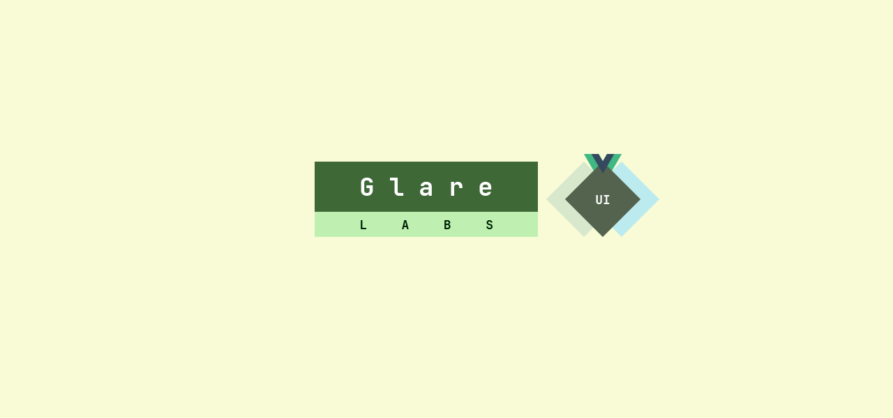

# @glare-labs/ui



`@glare-labs/ui` provides easy-to-use simple Vue components, provides complete type support, and is based on Vue3 and TypeScript.

With the help of the third-party library [`@material/material-color-utilities`](https://github.com/material-foundation/material-color-utilities), you can easily create a color scheme that conforms to the rules, and each component Following the design principles of [`Material Design 3`](https://m3.material.io/), this project tries its best to ensure that every component conforms to the [Specification](https://www.w3.org/TR/wai-aria-1.2/#abstract).

Our wiki is now live on [GitHub wiki](https://github.com/glare-labs/ui/wiki).

In an exciting moment, we uploaded [@glare-labs/ui](https://anti-mage.web.app) as our project official website. _Official website is subject to Firebase plan and rate restrictions._

## :eyes: Install

```
npm i @glare-labs/ui
```

## :zap: Highlights

+ Dynamic Theme
+ Dark mode & Light mode
+ Vue 3
+ TypeScript Supported
