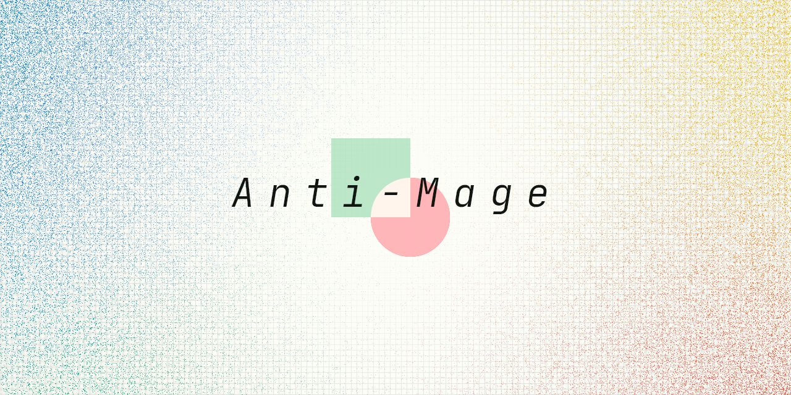
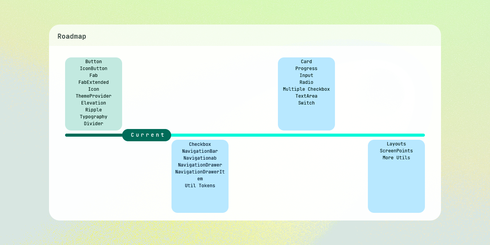

# material-anti-mage-vue

<div align="center">



Material Anti-Mage Vue

</div>

|Language|Link|
|:--|:--|
|**简体中文**|[./readme/zh/README.md](./readme/zh/README.md)|
|**English(Current Page)**|[./README.md](./README.md)|

Material Anti-Mage Vue provides easy-to-use simple Vue components, provides complete type support, and is based on Vue3 and TypeScript.

With the help of the third-party library [`@material/material-color-utilities`](https://github.com/material-foundation/material-color-utilities), you can easily create a color scheme that conforms to the rules, and each component Following the design principles of [`Material Design 3`](https://m3.material.io/), this project tries its best to ensure that every component conforms to the [Specification](https://www.w3.org/TR/wai-aria-1.2/#abstract).

## Roadmap



## Contribution Guidelines

### Code style
The project's code style configuration has been configured (you can improve the configuration file while maintaining the original code style). If you want to modify the code style configuration file, please edit `.eslintrc.cjs`. We do not recommend modifying the `settings.json` file in `./.vscode/`, at least do not turn off `Perform code formatting when saving files` .

The following list is **must be observed**:
+ Do not use semicolons (under any circumstances)
+ Use LF for line breaks (this convention is controlled by git)
+ Capitalize the first letter of the file name of the component file (for example `IconButton.type.ts`)
+ The folder name of the folder where the component sits is all lowercase (e.g. `icon-button`)
+ File names located in `./src/utils/` are all lowercase (e.g. `change-theme.ts`)

The following list is **not required**:
+ Leave a blank line next to the definition of functions, variables, and properties.
+ Do not have commas in type definitions
+ Object properties trailing comma

### Project file structure
The original files about the components are located in `./src/components/*`, please access them through the alias `@/components`.

Each component provides the following files, please create the template through `npm run template`.

|File Name|Description|
|:--|--:|
|index.ts|Export component|
|./internal/*.render.tsx|Provides the original code of the component|
|./internal/*.type.ts|Provides the type of the component|
|./internal/*.styles.ts|Provides styles for components|
|./internal/*.tokens.ts|Tokens that provide the style of the component|

### Create components
Before creating a component you need to make sure you have downloaded the project dependencies
```
npm i
```

The create component command will create a folder in `./src/components/`. The folder name and the creation of files inside the folder are completely completed through scripts. After you enter the following command, the console will wait for you to type the name of the component.
```
npm run template
```

Now you can navigate to `./src/components/` and view the template code you just created.

### Write props, slots, emits, styles
After creating the template code through the command (assuming you created the Button component through the command), you will see the following files in the `./src/components/Button` folder:
+ Button.render.ts
+ Button.type.ts
+ Button.styles.ts
+ Button.tokens.ts

Please go to other codes for reference.

#### props
Corresponds to the props section of the `Button.type.ts` file. All external properties should be written here.

The following code example shows the definition of the disabled attribute of a Button component (you must specify the default value and type of the attribute, and the type of the type attribute must be explicitly converted to PropType):
```typescript
import { props } from './Button.type'

export const renderButton = defineComponent({
     // Note that props are imported here
     props,
     // ...
})
```

```typescript
import { PropType } from 'vue'

export const props = {

     // Define props here
     disabled: {
         default: false,
         type: Boolean as PropType<boolean>
     },

}
```

#### slots
Corresponds to the slots section of the `Button.type.ts` file. All slots should be written here.

The following code example shows a default slot and a named slot (make sure the default slot and all other slots are optional in most cases):
```typescript
import { slots } from './Button.type'

export const renderButton = defineComponent({
     // Note that slots are imported here
     slots,
     // ...
})
```

```typescript
import { SlotsType } from 'vue'

export const slots = Object as SlotsType<{
    
     //Default slot defined here
     default?: void

     // other slots
     icon?: void

}>
```
#### emits
Corresponds to the emits section of the `Button.type.ts` file. All events should be written here.

```typescript
import { emits } from './Button.type'

export const renderButton = defineComponent({
     // Note that emits are imported here
     emits,
     // ...
})
```


```typescript
export const emits = [
     // Define custom events here
     'click'
]
```
#### styles
Corresponds to the sharedButtonStyles section of the `Button.styles.ts` file. Properties such as height, width, and color that should provide customization should be abstracted into `Button.tokens.ts`.

The following code shows styles that can be customized by external CSS:
```typescript
import { buttonTokens, buttonTokensExtern } from './Button.tokens'

export const sharedButtonStyles = StyleSheet.create({

     //Write root style here
     root: {

         //Write style here
         [buttonTokens.height]: `var(${buttonTokens.height}, var(${buttonTokens.height}))`,
         [buttonTokens.width]: `var(${buttonTokens.width}, var(${buttonTokens.width}))`,

     },

})
```

```typescript
import { makeComponentExternTokens, makeComponentTokens } from '@/utils/tokens'

// Assume your Button component abstracts height and width
const tokens = [
     'width',
     'height',
] as const

export const buttonTokens = makeComponentTokens<typeof tokens>(
     // The parameter here represents the name of your component. Please keep it all lowercase and use - to separate multiple words.
     'button',
     tokens
)
export const buttonTokensExtern = makeComponentExternTokens<typeof buttonTokens>(buttonTokens)
```

### Export component
Please export render and tokens in index.ts. Please use an alias when exporting render. The following code example assumes that you have written a render, and the code to export it is:
```typescript
// Assume this is a Button component you wrote yourself, and its name is renderButton.
export const renderButton = defineComponent({
     // ...
})
```

```typescript
/*
  * To export the renderButton component you wrote yourself, you need to give it an alias.
  * The name is based on renderButton to remove render
  *e.g.
  * renderButton -> Button
  * renderIcon -> Icon
  */
export { renderButton as Button } from './internal/Button.render'

/**
  * In addition to exporting the necessary components, you also need to export the tokens corresponding to the components
  */
export * from './internal/Button.tokens'
```

### Design guidance
Please make sure your code follows the MD3 spec section.

[Material Design 3](https://m3.material.io/)
